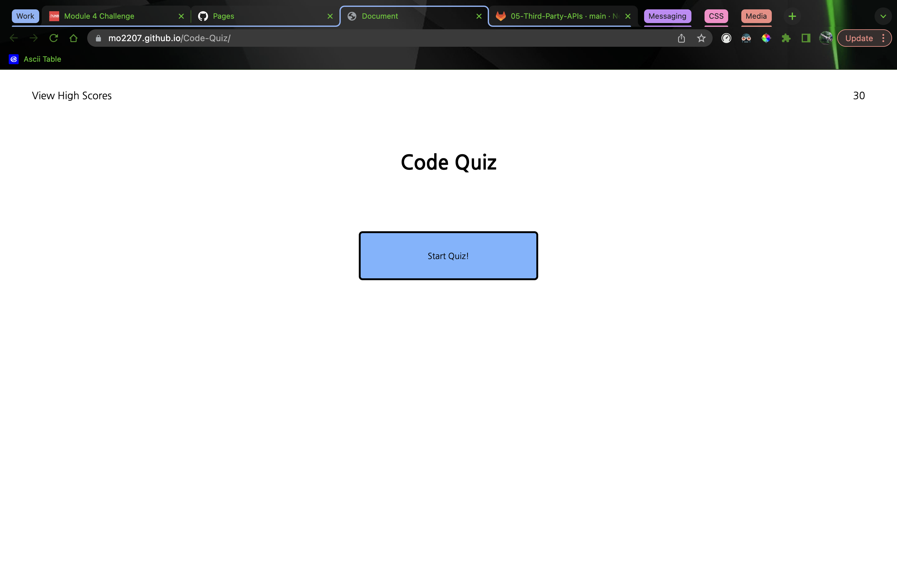
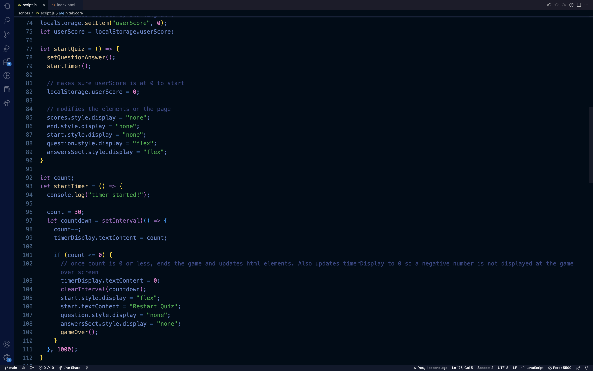

# Javascript Code-Quiz

## Description:
  
This quiz is a minigame that has a few basic javascript questions that you need to answer on a timer. The users score is tracked and can be added to the scoreboard at the end.
  - My motivation for this project was to gain a general understanding of how a basic game works.
  - I built this code quiz minigame to practise using localStorage to store data.
  - Building this project I learned how to change html elements using javascript (making them visible/invisible).
  
## Installation:
This project can be viewed using the live server or view in default browser extensions in VScode.

Or it can be viewed on github pages here: https://mo2207.github.io/Code-Quiz/

## Usage:

## Credits:
This project was done by myself once again, and with a lot of google as usual.

## License:
MIT license
